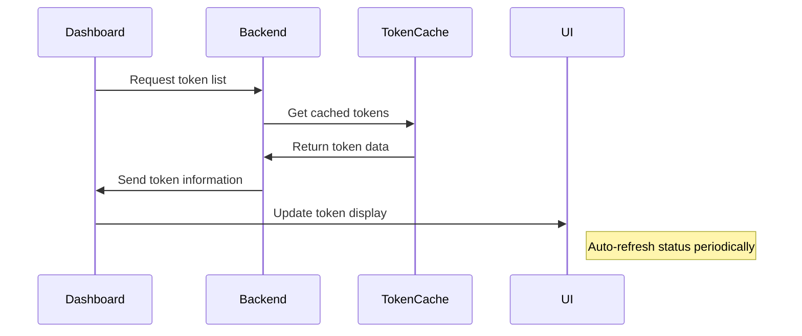

# Dashboard Technical Specification

## Overview
This document outlines the technical specification for implementing a frontend dashboard to manage and monitor GitHub Copilot (gho_) tokens in the copilot-more project.

## Core Requirements
- Display all loaded gho_ tokens
- Show token status and expiration
- Support future extensibility
- Monitor token validity

## Architecture Design

### Frontend Structure
```
frontend/
├── index.html          # Main dashboard page
├── style.css          # Styling
├── src/
│   ├── main.js        # Application entry point
│   ├── components/    # UI components
│   └── api/          # API integration
```

### Backend Integration
New API endpoints to be added to the existing FastAPI server:
```python
@app.get("/api/tokens")          # List all tokens
@app.post("/api/tokens")         # Add new token
@app.delete("/api/tokens/{id}")  # Remove token
@app.get("/api/tokens/{id}")     # Get token status
```

### Data Flow


## Implementation Phases

### Phase 1: Basic Dashboard
- Token list display
- Basic status indicators
- Token expiration display

### Phase 2: Token Management
- Add new tokens
- Remove existing tokens
- Token validation

### Phase 3: Real-time Updates
- WebSocket integration
- Live status updates
- Expiration countdown

### Phase 4: Advanced Features
- Rate limit monitoring
- Usage statistics
- System status
- Performance metrics

## Technical Decisions Pending
1. Dashboard Type:
   - Static vs Single-page application (SPA)
   - Framework selection if SPA

2. Styling Approach:
   - Theme preferences (dark/light mode)
   - UI component library vs custom styling

3. Security:
   - Authentication requirements
   - Token storage approach
   - Access control

## Next Steps
1. Confirm technical decisions
2. Begin frontend implementation
3. Add backend API endpoints
4. Integrate with existing token management system